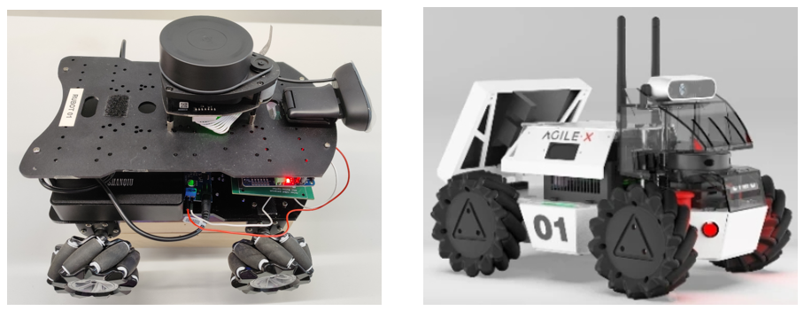
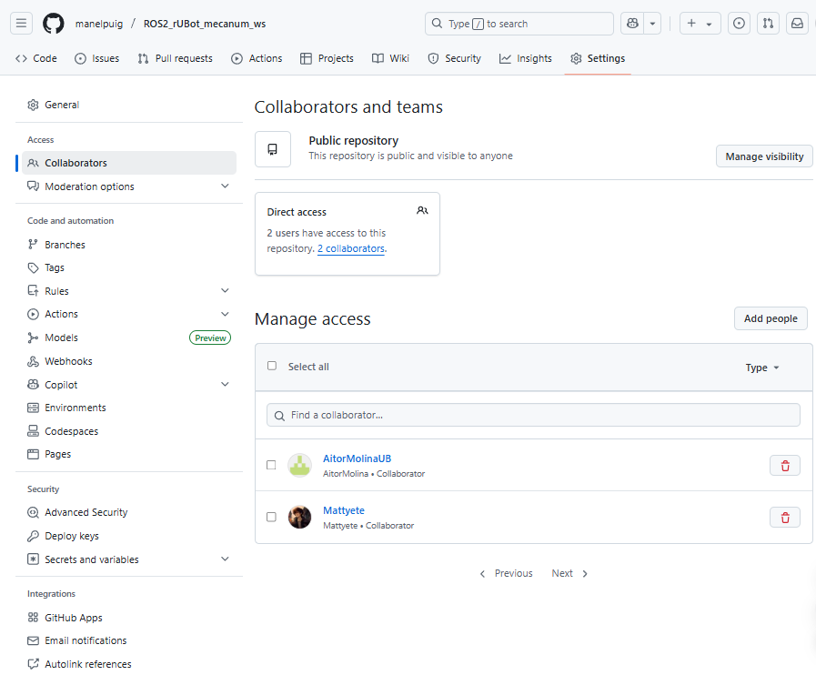
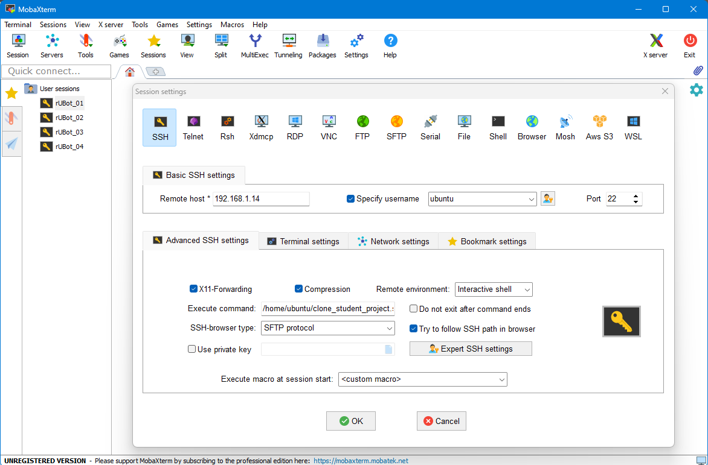

# **ROS2 rUBot setup**

The objectives of this section are:
- Setup the robot project in virtual environment for simulation
- Setup the robot project for real control
- Syncronization of the project with github

We have two kind of rbots:
- UB custom made **rUBot_mecanum**
- Commercial **LIMO** robot



Webgraphy:
- Webgraphy:
- [TheConstruct: Build Your First ROS2 Based Robot](https://www.robotigniteacademy.com/courses/309)

- [LIMO official repository](https://github.com/agilexrobotics/limo_ros2/tree/humble)
- [LIMO official Doc](https://github.com/agilexrobotics/limo_pro_doc/blob/master/Limo%20Pro%20Ros2%20Foxy%20user%20manual(EN).md)
- [LIMO in bitbucket](https://bitbucket.org/theconstructcore/limo_robot/src/main/)
- [TheConstruct in Bitbucket](https://bitbucket.org/theconstructcore/workspace/projects/ROB)
- [TheConstruct image Humble-v3](https://hub.docker.com/r/theconstructai/limo/tags)
- [ROS2 course A. Brandi](https://github.com/AntoBrandi/Self-Driving-and-ROS-2-Learn-by-Doing-Odometry-Control/tree/main)
- [ROS1 course A. Brandi](https://github.com/AntoBrandi/Self-Driving-and-ROS-Learn-by-Doing-Odometry-Control)
- [Arduino-bot course A. Brandi](https://github.com/AntoBrandi/Arduino-Bot/tree/humble)
- [Projecte TFG Matthew Ayete](https://github.com/Mattyete/ROS2_LIMO_ws/blob/main/Documentation/LIMO_Manual.md)


## **1. Setup the robot project in virtual environment for simulation**

For **simulation** we will use TheConstruct interface. When working in Laboratory groups, we suggest you:
- One student plays the role of `Director`. This student makes a "Fork" of the Professor's github project.
- The `Director` accept the other students as `Collaborators`

- Then the `Collaborators` will make a "fork" of the `Director`'s github project.
- The `Collaborators` will be able to update the github `Director`'s project and participate on the project generation

To work on the project (during lab sessions or for homework), each student has to clone the `Director`'s github project in the `TheConstruct working environment`.
- Open your ROS2 Humble environment:  https://app.theconstructsim.com/
- Open your created ROS2_Humble Rosject project
- First time, clone your forked `Director`'s github project
  ```shell
  cd /home/user
  git clone https://github.com/director_username/ROS2_rUBot_mecanum_ws
  cd ROS2_rUBot_mecanum_ws
  colcon build
  ```
  >Successives times, in TheConstruct simulation environment, you can update the project with:
  ```shell
  git pull
  ```
- Add in .bashrc the lines:
  ````shell
  export ROS_DOMAIN_ID=0
  export RMW_IMPLEMENTATION=rmw_cyclonedds_cpp
  export GAZEBO_MODEL_PATH=/home/user/ROS2_rUBot_mecanum_ws/src/my_robot_bringup/models:$GAZEBO_MODEL_PATH
  source /opt/ros/humble/setup.bash
  source /usr/share/colcon_argcomplete/hook/colcon-argcomplete.bash
  source /home/user/ROS2_rUBot_tutorial_ws/install/setup.bash
  source /home/user/ROS2_rUBot_mecanum_ws/install/setup.bash
  #cd /home/user/ROS2_rUBot_tutorial_ws
  cd /home/user/ROS2_rUBot_mecanum_ws
  ````
- If the compilation process returns warnings on "Deprecated setup tools", proceed with:
  ````shell
  sudo apt install python3-pip
  pip3 list | grep setuptools
  pip3 install setuptools==58.2.0
  ````
- If the compilation process returns wardings on PREFIX_PATH:
  ````shell
  unset COLCON_PREFIX_PATH
  unset AMENT_PREFIX_PATH
  unset CMAKE_PREFIX_PATH
  cd ~/ROS2_rUBot_mecanum_ws
  rm -rf build/ install/ log/
  source /opt/ros/humble/setup.bash
  colcon build
  ````
- Open a new terminal to ensure the .bashrc is read again

## **2. Setup the robot project for real control**

The setup process is based on a custom Ubuntu22.04 with the ROS2 Humble environment and the needed packages used on the rUBot project.

A speciffic installation is made for the UB custom rUBot mecanum robot and for the commercial LIMO robot.

### **2.1. Setup the rUBot mecanum**

The UB custom rUBot mecanum custom made robot is based on:
- Raspberrypi4 computer onboard
- Custom ROS2 configuration in Ubuntu22.04 server 64bits.

When the real robot is plugged on, you will access to the robot using MOBAXterm:
- Open rUBot_0x session and specify the `Director`student project (4minutes aprox)

  
  >This script will make the project clone, compilation, .bashrc configuration and robot bringup
- Verify in a new terminal the working nodes:
  ````shell
  ros2 node list
  ````


You will see the main nodes running and you are ready to control the robot

### **2.2. Setup the LIMO robot**

The commercial LIMO robot is based on:
- Jetson Nano computer onboard
- Custom Dockerfile and docker-compose to create a custom ROS2 Docker container.

When the commercial LIMO robot is plugged on, the docker-compose-v3.yaml service is executed and the LIMO robot is ready to be controlled within the TheConstruct environment.

- `Local control`: Connecting to the LIMO robot with VScode window attached to the container:
  ````shell
  ros2 launch limo_bringup limo_start.launch.py
  ````

- `Remote control`: Using the TheConstruct Real Robot Lab. service
  - Install the LIMO robot on your account (this is already done for you)
  - Connect to the robot and type in a new terminal
    ````shell
    ros2 node list
    ````
  - You will see the main nodes running

## **3. Update and syncronize the repository project**

When working in Laboratory groups, we suggest you:

- `Before working on the project`, update the local repository with possible changes in github origin repository
  ````shell
  git pull
  ````
- You can work with your local repository for the speciffic project session
- `Once you have finished and you want to syncronize the changes` you have made and update the github origin repository, type:
  ````shell
  git add .
  git commit -m "Message"
  ````
- When you will Push them, the first time you will be asked to link the repository to your github account:
- Open a terminal in and type your credentials:
  ```shell
  git config --global user.email "xxx@alumnes.ub.edu"
  git config --global user.name "your_github_username"
  git commit -m "Message"
  git push
  ```
  > change the email and username and message
- You will have to specify your Username and Password (Personal Access Token you have generated)

To obtain the **PAT** in github follow the instructions:

  - Log in to GitHub
  - Click on your profile picture and select `settings`
  - Select `Developer Settings`
  - Select Access Personal Access Tokens: Choose Tokens (classic)
  - Click Generate new token (classic) and configure it:
    - Add a note to describe the purpose of the token, e.g., "ROS repo sync."
    - Set the expiration (e.g., 30 days, 60 days, or no expiration).
    - Under Scopes, select the permissions required:
      - For repository sync, you usually need: repo (full control of private repositories)
    - Click Generate token
  - Once the token is generated, copy it immediately. You won't be able to see it again after leaving the page.

The `Director`'s github repository has been updated!