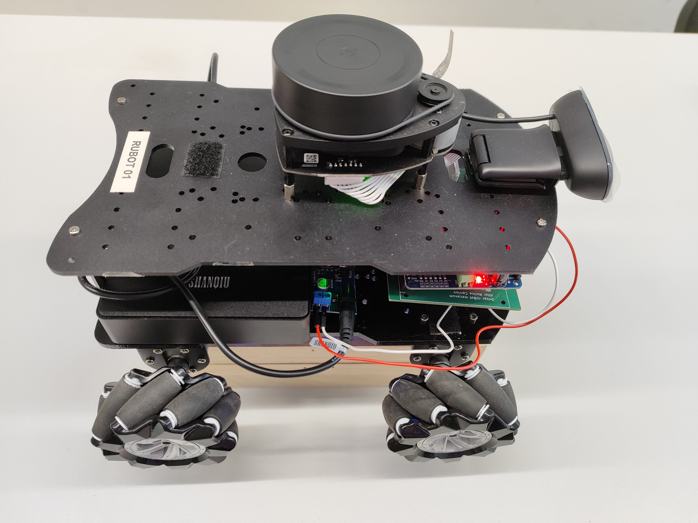
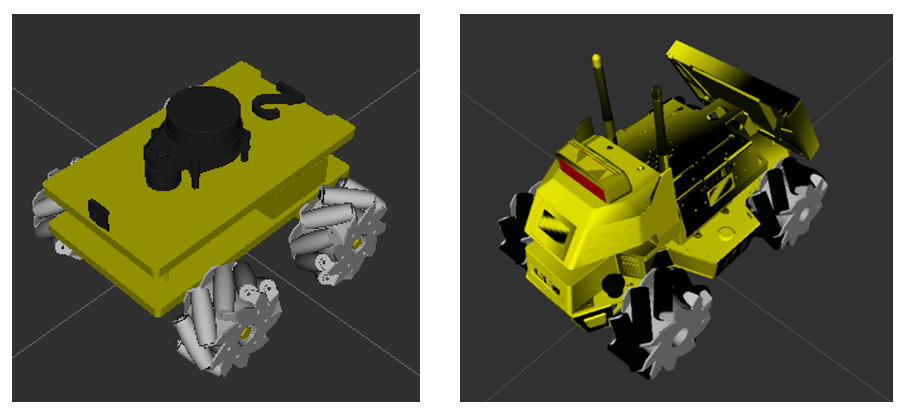
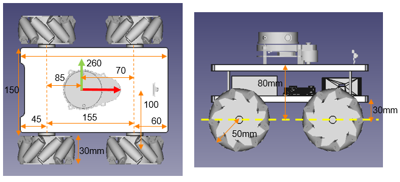

## **2. ROS2 rUBot model and Bringup**
The main objective of this section is to simulate the rUBot behaviour in virtual environment.

The particular objectives of this section are:
- Create a complete robot model of our rUBot Mecanum
- Create a world model of the virtual environment
- Bringup the robot in virtual environment
- Bringup the real robot.

The rUBot mecanum robot we will work is represented in the picture:


A very good guide is described in: https://www.udemy.com/course/ros2-tf-urdf-rviz-gazebo/learn/lecture/38688920#overview

### **2.1. Create a robot model of our rUBot mecanum**

Different robot models have been created to be used in ROS2 Virtual environment:
- Differential-Drive robot
- Mecanum-Drive robot

These 2 kind of robot models can be equipped with a robotic arm:


With 3D custom designed parts (rUBot and Limo robots):



The file format for a robotic model is:
- **URDF** (Unified Robot Description Format): XML-based format to describe the physical configuration of a robot, including its links, joints, and sensors.
- **XACRO** (XML Macros): XML-based, but with macro capabilities for generating URDF files. This format will help you to better organize and scale your model with more functionalities.

### **rUBot Mecanum Model design**

The geometrical definition of our rUBot is graphically described by:


The different elements (named **links**) are:
- base_link
- wheels
- camera
- base_scan

These elements are connected each-other by **joints**:
- base_link_joint
- wheel_joint
- joint_camera
- scan_joint


Some of these links have a speciffic **functionalities**:
- wheels: perform a robot movement according to a Mecanum-drive kinematics
- camera: view front images
- base_scan: detect obstacle distances in 360º around the robot

To create our robot model, we use **URDF files** (Unified Robot Description Format). URDF file is an XML format file for representing a robot model.(http://wiki.ros.org/urdf/Tutorials)

The general structure of a robot urdf model is based on:
- Links and joints: for the geometrical structure
- Gazebo plugins: for the functionalities

The urdf file structure is:
```xml
<?xml version="1.0" encoding="utf-8"?>
<robot name="rubot">
  <link name="base_link">
  ...
  </link>
  <joint name="base_link_joint" type="fixed">
  ...
  </joint>
  <gazebo>
    <plugin name="Mecanum_controller" filename="libgazebo_ros_planar_move.so">
    ...
    </plugin>
  </gazebo>
  <gazebo reference="upper_left_wheel">
  ...
  </gazebo>
</robot>
```

We have created 2 folders for model description:
- URDF: folder where different URDF models are located. In our case rubot.urdf
- meshes: folder where 3D body models in stl format are located. We will have rubot folder.

As we have explained above, main parts of URDF model are:
- links: diferent bodies/plastic elements
- joints: connection between 2 links 
- sensors & actuators plugins (2D camera, LIDAR and 4-wheels mecanum-drive)

The **link definition** contains:
- visual properties: the origin, geometry and material
- collision properties: the origin and geomnetry
- inertial properties: the origin, mass and inertia matrix

The **joint definition** contains:
- joint Type (fixed, continuous)
- parent and child frames
- origin frame
- rotation axis

In the case or upper left wheel link:
```xml
<!-- upper_left_wheel -->
  <joint name="upper_left_wheel_joint" type="continuous">
    <origin rpy="0 0 0" xyz="0.07 0.1 0"/>
    <parent link="base_link"/>
    <child link="upper_left_wheel"/>
    <axis xyz="0 1 0"/>
  </joint>
  <link name="upper_left_wheel">
    <visual>
      <origin rpy="0 0 0" xyz="0 0 0"/>
      <geometry>
        <mesh filename="file://$(find my_robot_description)/meshes/upper_left_wheel.stl" scale="0.001 0.001 0.001"/>
        <!-- <cylinder length="0.03" radius="0.05"/>-->
      </geometry>
      <material name="light_grey"/>
    </visual>
    <collision>
      <origin rpy="-1.57 0 0" xyz="0 0 0"/>
      <geometry>
        <cylinder length="0.03" radius="0.055"/>
      </geometry>
    </collision>
    <inertial>
      <mass value="0.2"/>
      <inertia ixx="0.000166" ixy="0" ixz="0" iyy="0.000303" iyz="0" izz="0.000166"/>
    </inertial>
  </link>
```
The rUBot model includes different **sensors and actuators**:

The full model contains also information about the sensor and actuator controllers using specific **Gazebo plugins**:
- https://classic.gazebosim.org/tutorials?tut=ros_gzplugins
- https://github.com/ros-simulation/gazebo_ros_pkgs/tree/ros2/gazebo_plugins/include/gazebo_plugins

Gazebo plugins give your URDF models greater functionality and compatiblility with ROS messages and service calls for sensor output and motor input. 

These plugins can be referenced through a URDF file, and to insert them in the URDF file, you have to follow the sintax:

**2D-camera Sensor**:

The two-dimensional camera sensor corresponds to the USB real camera. 

This camera obtains 2D images in the front and is simulated in URDF model as:
- link with the visual, collision and inertial properties
- joint of fixed type
- Gazebo plugin as a sort of "driver" to simulate the real behaviour

Review the joint and link definition in URDF model.

The used Gazebo plugin is:

```xml
  <!-- 2D Camera controller -->
  <gazebo reference="camera">
    <sensor name="camera1" type="camera">
      <update_rate>30.0</update_rate>
      <camera name="front">
        <horizontal_fov>1.3962634</horizontal_fov>
        <image>
          <width>320</width>
          <height>240</height>
          <format>R8G8B8</format>
        </image>
        <clip>
          <near>0.02</near>
          <far>300</far>
        </clip>
      </camera>
      <plugin filename="libgazebo_ros_camera.so" name="camera_controller">
        <alwaysOn>true</alwaysOn>
        <visualize>false</visualize>
        <cameraName>rubot/camera1</cameraName>
        <imageTopicName>image_raw</imageTopicName>
        <cameraInfoTopicName>camera_info</cameraInfoTopicName>
        <frameName>camera</frameName>
        <hackBaseline>0.07</hackBaseline>
        <distortionK1>0.0</distortionK1>
        <distortionK2>0.0</distortionK2>
        <distortionK3>0.0</distortionK3>
        <distortionT1>0.0</distortionT1>
        <distortionT2>0.0</distortionT2>
      </plugin>
    </sensor>
  </gazebo>
  ```
>To view the camera image you can:
> - add the line in the plugin 
> ```xml
><visualize>true</visualize>"
> ```
> - use rviz
> - type rqt in a terminal and select Plugins->Visualization->Image View
>
>Alternativelly with false in plugin, you can allways call the image typing in a new terminal:
>```shell
>rqt image view
>```

**RPlidar sensor**

A Lidar sensors is  device that is able to measure the obstacle distances at 360º around the robot. 

He is sending 720 laser beams (2 beams/degree) and measures the distance each laser beam finds an obstacle. He is able to measure from 12cm to 10m. The used Lidar sensor is a 360º RPLidar A1M8 (https://www.robotshop.com/es/es/rplidar-a1m8-kit-desarrollo-escaner-laser-360-grados.html)

This lidar is simulated in URDF model as:
- link with the visual, collision and inertial properties
- joint of fixed type
- Gazebo plugin as a sort of "driver" to simulate the real behaviour

 Review the joint and link definition in URDF model.
> Note that rpLIDAR is mounted at 180º and you need to turn the link model and the joint to reflect this in the URDF model.


The gazebo plugin we have used is:
```xml
  <!-- Laser Distance Sensor YDLIDAR X4 controller-->
  <gazebo reference="base_scan">
    <sensor name="lidar" type="ray">
    <pose>0.215 0 0.215 0 0 0</pose>
    <always_on>true</always_on>
    <visualize>false</visualize>
    <update_rate>5</update_rate>
    <ray>
      <scan>
        <horizontal>
          <samples>720</samples>
          <resolution>1.00000</resolution>
          <min_angle>0.000000</min_angle>
          <max_angle>6.280000</max_angle>
        </horizontal>
      </scan>
      <range>
        <min>0.120000</min>
        <max>3.5</max>
        <resolution>0.015000</resolution>
      </range>
      <noise>
        <type>gaussian</type>
        <mean>0.0</mean>
        <stddev>0.01</stddev>
      </noise>
    </ray>
    <plugin name="scan" filename="libgazebo_ros_ray_sensor.so">
      <ros>
        <remapping>~/out:=scan</remapping>
      </ros>
      <output_type>sensor_msgs/LaserScan</output_type>
      <frame_name>base_scan</frame_name>
    </plugin>
    </sensor>
  </gazebo>
```
>To view the LIDAR rays be sure to add 
> ```xml
><visualize>true</visualize>"
> ```
> or use rviz

It is important to note that:
- the number of points of real RPLidar depends on Lidar model (you will need tot test it first)
- the number of points of simulated Lidar is selected to 720

**Actuator**:

The rUBot_mecanum contains a "Mecanum drive actuator" based on:
- 4 wheels driven by a DC servomotor 
- with speciffic Kinematic control 
- able to move the robot in x and y directions
- and able to obtain the Odometry information

Gazebo plugin is a sort of "driver" to simulate the Kinematics of our rUBot_mecanum.

The **rUBot_mecanum kinematics** describes the relationship between the robot wheel speeds and the robot velocity. We have to distinguish:
- **Forward kinematics**: obtains the robot velocity (linear and angular in /cmd_vel) and POSE (odometry) for speciffic robot wheel speeds
- **Inverse kinematics**: obtains the robot wheels speeds for a desired robot velocity (linear and angular in /cmd_vel)

This kinematics and odometry calculations are described in the "libgazebo_ros_planar_move.so" file and the URDF model will contain the specific gazebo plugin.

This driver is the "Planar Move Plugin" and is described in Gazebo tutorials.
```xml
  <!-- Mecanum drive controller -->
  <gazebo>
        <plugin name="mecanum_controller" filename="libgazebo_ros_planar_move.so">
            <command_topic>cmd_vel</command_topic>
            <odometry_topic>odom</odometry_topic>
            <odometry_frame>odom</odometry_frame>
            <odometry_rate>20.0</odometry_rate>
            <robot_base_frame>base_footprint</robot_base_frame>
            <publish_odom>true</publish_odom>
            <publish_odom_tf>true</publish_odom_tf>
            <wheel_radius>0.04</wheel_radius>
            <base_length>0.65</base_length>
            <base_width>0.65</base_width>
            <publish_wheel_tf>true</publish_wheel_tf>
            <front_left_joint>upper_left_wheel_joint</front_left_joint>
            <front_right_joint>upper_right_wheel_joint</front_right_joint>
            <rear_left_joint>lower_left_wheel_joint</rear_left_joint>
            <rear_right_joint>lower_right_wheel_joint</rear_right_joint>
            <wheel_max_speed> 20.0 </wheel_max_speed>
            <wheel_acceleration> 10.0</wheel_acceleration>
            <joint_config>1 1 1 1</joint_config>
        </plugin>
  </gazebo>
  ```

### **RVIZ ROS visualization Tool**

We will first use RVIZ to check that the model is properly built. 

RViz only represents the robot visual features. You have available all the options to check every aspect of the appearance of the model.

We use a specific "display.launch" launch file where we specify the robot model we want to open in rviz with a configuration specified in "urdf.rviz":
```xml
<launch>
    <let name="urdf_path" 
         value="$(find-pkg-share my_robot_description)/urdf/rubot/rubot_mecanum.urdf" />
    <let name="rviz_config_path"
         value="$(find-pkg-share my_robot_description)/rviz/urdf_config.rviz" />

    <node pkg="robot_state_publisher" exec="robot_state_publisher">
        <param name="robot_description"
               value="$(command 'xacro $(var urdf_path)')" />
    </node>

    <node pkg="joint_state_publisher_gui" exec="joint_state_publisher_gui" />

    <node pkg="rviz2" exec="rviz2" output="screen" 
          args="-d $(var rviz_config_path)" />
</launch>
```
You can type in a new terminal:
```shell
ros2 launch my_robot_description display.launch.xml
```


>**Important**: In urdf file, the path to stl files has to be specified with:
````xml
<mesh filename="file://$(find my_robot_description)/meshes/rubot/base_link.stl" scale="0.001 0.001 0.001"/>
````
> Colors in rviz: 
>- are defined at the beginning
>- Ensure the "visual" link properties have color "name"
```xml
<robot name="rubot">
  <material name="yellow">
    <color rgba="0.8 0.8 0.0 1.0"/>
  </material>

  ...

    <link name="base_link">
    <visual>
      <origin rpy="0 0 0" xyz="0 0 0"/>
      <geometry>
        <mesh filename="file://$(find my_robot_description)/meshes/rubot/base_link.stl" scale="0.001 0.001 0.001"/>
      </geometry>
      <material name="yellow"/>
    </visual>
```

### **2.2. Bringup the rUBot in virtual world environment**

In robotics research, always before working with a real robot, we simulate the robot behaviour in a virtual environment close to the real one. **Gazebo** is an open source 3D robotics simulator and includes an ODE physics engine and OpenGL rendering, and supports code integration for closed-loop control in robot drives. This is sensor simulation and actuator control.

For this purpose, a new package "my_robot_bringup" is created.

We have also created a new "my_robot_gazebo.launch.xml" file to spawn the robot in a virtual designed world (square2.world):
```xml
<launch>
     <let name="x0" value="0.5"/>
     <let name="y0" value="0.5"/>
     <let name="yaw0" value="1.57"/>

     <let name="urdf_path" 
         value="$(find-pkg-share my_robot_description)/urdf/robot_arm/my_mecanum_robot.urdf.xacro" />
     <let name="rviz_config_path"
         value="$(find-pkg-share my_robot_bringup)/rviz/urdf_config.rviz" />

     <node pkg="joint_state_publisher" exec="joint_state_publisher" />
     <node pkg="robot_state_publisher" exec="robot_state_publisher">
        <param name="robot_description"
               value="$(command 'xacro $(var urdf_path)')" />
     </node>

     <include file="$(find-pkg-share gazebo_ros)/launch/gazebo.launch.py">
          <arg name="world" value="$(find-pkg-share my_robot_bringup)/worlds/square2.world" />
     </include>

     <node pkg="gazebo_ros" exec="spawn_entity.py"
          args="-topic robot_description -entity my_robot -x $(var x0) -y $(var y0) -Y $(var yaw0)" />

     <node pkg="rviz2" exec="rviz2" output="screen" 
          args="-d $(var rviz_config_path)" />
</launch>
```

- If you have made any changes, you need to compile again
```shell
colcon build
source install/setup.bash
```
You can now bringup your robot in the designed world
```shell
ros2 launch my_robot_bringup my_robot_gazebo.launch.xml
```


> Be careful to write the entity name in launch file corresponding to the one defined in urdf model ("rubot" in this case)

**Activity:**

Bringup your rUBot model within the real custom designed World

### **2.4. First driving Control**

The objective here is only to verify that the robot is correcly bringup and we can control it using the "teleop-twist-keyboard" package.

- Install the "teleop-twist-keyboard" package.
```shell
sudo apt update
sudo apt install ros-humble-teleop-twist-keyboard
```
- Bringup our robot in Gazebo virtual environment
```shell
ros2 launch my_robot_bringup my_robot_gazebo.launch.xml
```
- Launch the teleop-twist-keyboard:
```shell
ros2 run teleop_twist_keyboard teleop_twist_keyboard
```
- open a new terminal and listen the /odom topic
```shell
ros2 topic echo /odom
```
- Print the Nodes and topics using rqt_graph


