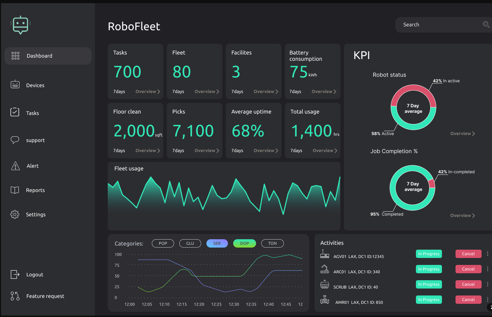
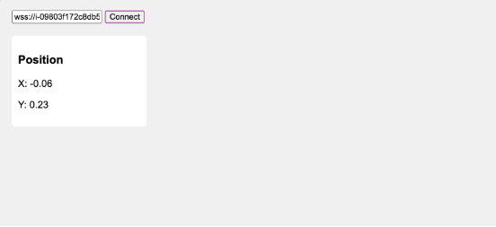
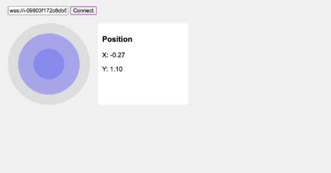
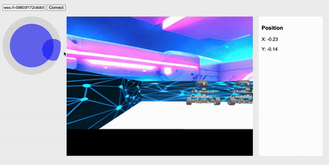

# Create a Dashboard to Control Your ROS2 Robot from a Web Browser
Web Dashboard provides a framework for controlling and monitoring robotic systems remotely.



Most robots used in companies come with web dashboards, allowing operators to easily control the robot's core functions and view diagnostic information without needing to rely on development tools like RViz2 or ros commands to interact with the robot.

For this, we will be using `rosbridge` and `roslibjs`, allowing us to control the robot with buttons on the dashboard instead of using keyboard teleop directly on the robot.

Some of the main functions of `rosbridge_server` include:

1. Creating a WebSocket connection, which allows bidirectional communication between the robot and web browsers⁠⁠

2. Exposing ROS's publish/subscribe functionality, enabling web applications to publish and subscribe to ROS topics⁠⁠

3. Stablish communication between ROS and web browsers

You need first to add a “web” folder to your ROS 2 workspace:

````lua
ros2_ws/
├─ src/
│  └─ … your robot packages …
└─ web/
   ├─ index.html
   └─ (optional) js/roslib.min.js   <-- vendor the file to avoid CDN issues
````

# 🚀 Run ROS 2 Web Control for rUBot in virtual environment

This guide explains how to control your rUBot in simulation using TheConstruct environment.

In the client side we use `roslibjs` that plays a key role as the JavaScript library that allows the web dashboard to communicate with the ROS system via the rosbridge_server. Specifically, it provides an easy way to interact with ROS topics, services, and parameters through a WebSocket connection, which allows real-time communication between the webpage and ROS.
You need to install `rosbridge-server`
    ```bash
    sudo apt install ros-humble-rosbridge-server
    ````
Then you proceed with:
- Let's first bringup the robot in virtual environment
    ````shell
    ros2 launch my_robot_bringup my_robot_bringup_sw.launch.xml
    ````
- Launch the rosbridge. In a terminal 2 type:
    ````shell
    ros2 launch rosbridge_server main_rosbridge_launch.py
    ````
- Launch the web server. In a terminal 3 type:
    ````shell
    cd ~/ROS2_rUBot_mecanum_ws/web
    python3 -m http.server 7000
    ````
- In a local network you have to click on the webpage generated: `http://0.0.0.0:7000`
- In a VPN as the one we are using, we have generated a speciffic webpage in a different address. You will know the address if you open a terminal 4 and type: `webpage_address`
- Click on this address or copy that link and open it in your browser.
- In the connection field we have to write the address where our RosBridge is run. In order to get the rosbridge address you can run the following command:`rosbridge_address`
- Once you connect there is no message. If you want to see a log message you have to open the Development tools


# 🚀 Run ROS 2 Web Control for rUBot setup

This guide explains how to control your ROS2 robot from a **web browser**  
when the **Robot (Raspberry Pi)** and the **PC (Windows 11)** are on the same WiFi/LAN.

---

## 1. On the **Robot (Raspberry Pi)**

Open a terminal (SSH or local):

```bash
# Make sure rosbridge is installed
sudo apt update
sudo apt install ros-humble-rosbridge-server -y

# Start rosbridge websocket (port 9090)
ros2 launch rosbridge_server rosbridge_websocket_launch.xml
````
This starts a WebSocket server at:
````shell
ws://<ROBOT_IP>:9090
````
## 2. On the PC (Windows 11)
- Step 1. Prepare the web folder

    You do not need the full ros2_ws repository.
    Just copy the web/ folder (with your index.html) to the PC.

    Example structure:
    ````shell
    C:\Users\YourName\web\
                        └── index.html
    ````


- Step 2. Run a simple HTTP server

    Open PowerShell or CMD and run:
    ````python
    cd C:\Users\YourName\web
    python -m http.server 8000
    ````
    This starts a simple HTTP server on port 8000.  

    Now your web folder is served at: http://<PC_IP>:8000/

    where <PC_IP> is your Windows PC’s IP on the LAN (check with ipconfig).

## 3. On the Browser (on your PC)

- Open Chrome / Edge / Firefox.

- Go to: `http://<PC_IP>:8000/`

    The page (index.html) will load.

- In the connection box of the page, type:
    ````shell
    ws://<ROBOT_IP>:9090
    ````
- Click Connect → it should show Connected.

You will be ready to control your robot from the web page!

Let's see some control examples of how to use this web dashboard.

## 1. Dashboard to update the Position of the Robot

This example shows how to create a simple web dashboard to update the position of the robot. The `index_position.html` file contains a simple form to update the position of the robot.

You can find the code in the `web` folder of the repository.

Remember to copy this file as `index.html` in the `web` folder of PC

The updated page should look something like this:


You can move the robot around with the following program:
````shell
ros2 run teleop_twist_keyboard teleop_twist_keyboard
````
You should see that the odom data updates in real time in the webpage.

## 2. Dashboard to update the Position of the Robot
This example shows how to create a simple web dashboard to move your robot and visualize our position in the webpage.

To be able to move the robot through a virtual joystick we will be using another small library called nippleJS (https://github.com/yoannmoinet/nipplejs) which provides an easy way to add joystick to any website.

The `index_joycontrol.html` file contains a simple form to update the position of the robot.

You can find the code in the `web` folder of the repository.

Remember to copy this file as `index.html` in the `web` folder of PC

The updated page should look something like this:


## 2. Dashboard to update the Position of the Robot
This example shows how to create a simple web dashboard to to move your robot with a virtual joystick, visualize our position and view the camera streaming images in the webpage.

The `index_JoyPosCam.html` file contains a simple form to update the position of the robot.

You can find the code in the `web` folder of the repository.

Remember to copy this file as `index.html` in the `web` folder of PC

The updated page should look something like this:

