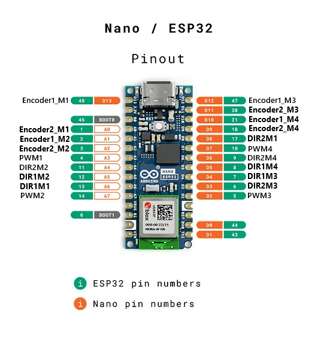
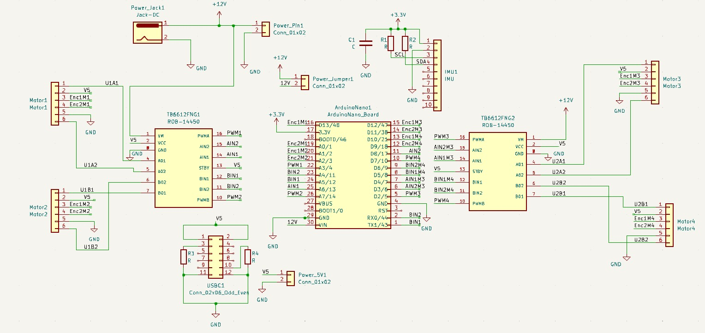
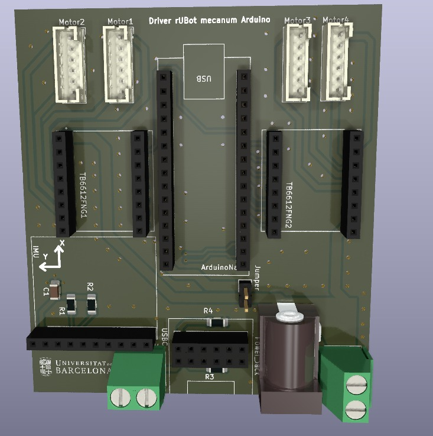
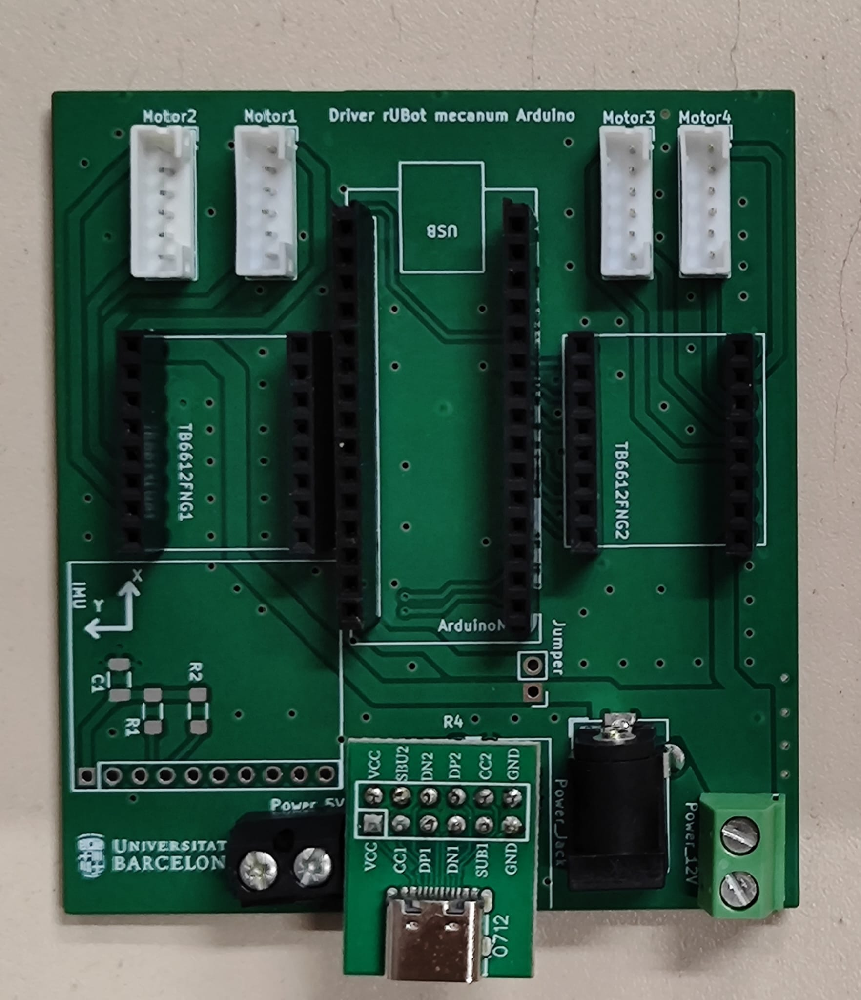

# **ROS2 rUBot driver**

The main objective is to create a "my_robot_driver" package to control the rUBot.

The general architecture is a ROS2 package containing a driver node that connects to an arduino board using serial communication to send closed loop velocity commands and receive encoder values in real time.

Webgraphy:
- TheConstruct course:Build Your First ROS2 Based Robot https://www.robotigniteacademy.com/courses/309
- https://github.com/joshnewans/ros_arduino_bridge

## **1. Arduino based Robot Driver**

The objective of this section is to create a proper driver for rUBot. We have made 2 different arduino boards:
- using Arduino Nano: https://store.arduino.cc/products/arduino-nano
- using Arduino Nano-ESP: https://store.arduino.cc/products/nano-esp32

Here is described the Drivers designed for real robots in ROS2:
- Differential drive robot: Using Arduino Nano and Arduino Nano ESP32 boards
- Mecanum drive robot: Using Arduino Nano ESP32 board

The created packages are designed for a differential drive 2 wheeled robots considering the course designed by TheConstruct.

The general architecture is based on:
- ROS2 Humble environment with a custom Docker contained in a Raspberrypi4 (or 5)
- A local ROS2_rubot_mecanum_ws responsible of the custom UB robot bringup
- Arduino based microprocessor: to drive the wheels in CL with a serial messaging protocol
  - Differential drive robot:
    - Arduino nano board: with `rubot_driver-nano_diff.ino` program
    - Arduino nano ESP32 board: with `rubot_driver-nano_ESP32_diff.ino` program
  - Mecanum drive robot:
    - Arduino nano ESP32 board: with `rubot_driver-nano_ESP32_mec.ino` program
- A labtop/PC server with a global ROS2_rubot_mecanum_ws responsible to high level control of the robot

We will analyse:
- PCB board design
- Differential drive robot programs
- Mecanum drive robot programs
- Robot control program in ROS2 environment
- Robot bringup program in ROS2 environment

### **1.1. PCB board design**

A speciffic PCB board is designed to interface the Arduino nano (or Arduino nanoESP32) with the 4 DC-motors with encoder and an IMU sensor.

The Arduino nano and Nano ESP32 pinout:


The schematic of the driver shield:


The final render of the driver shield:


The final real driver shield:


### **1.2. Differential drive robot programs**

The Differential robot driver is created for Arduino nano (rubot_driver_nano_diff) and Arduino nano ESP32 (rubot_driver_nano_esp32_diff).

The program defined is based on the ROSArduinoBridge project included in a speciffic folder.

Its main characteristics are:
- Differential Drive Control: Provides commands for controlling the speed of a two-wheeled robot.
- Sensor Data Acquisition: Enables receiving sensor data and odometry information from the Arduino.
- Configurable Hardware: Supports Arduino Mega, Pololu motor controller shield, and Robogaia Mega Encoder shield by default, with adaptable functions for other hardware.
- Serial Communication: Uses simple serial commands for communication between ROS and Arduino.
- Modular Design: Includes separate files for commands, sensors, motor drivers, and encoders.
- PID Control (Optional): Implements a Proportional-Integral-Derivative (PID) controller for precise motor control (if USE_BASE is defined).
- Servo Control (Optional): Supports control of PWM servos (if USE_SERVOS is defined).
- Automatic Stop: Features an auto-stop mechanism if no motor commands are received for a defined interval.
- Command Parsing: Includes functionality to parse serial commands with arguments.

### **1.3. Mecanum drive robot programs**

The Mecanum robot driver is created only for Arduino nano ESP32 (rubot_driver_nano_esp32_mec) because only this board offers enough Digital IO pins for the 4-wheeled platform.

#### **Pin Configuration**

Since the Arduino NanoESP32 has both Arduino and ESP32 chips, the pins can be programmed using the Arduino configuration or by number of GPIO by ESP32 configuration.

Before compiling the code we need to set in **Tools -> Ping Numbering -> By GPIO Number(legacy)** to set the correct pin configuration.

For every motor we will configure one PWM pin that will set the speed of the motor and two Digital Outputs that will set the direction at wich the motor is rotating, these signals will go from the Arduino NanoESP32 direcly to the TB6612fng 2-wheel driver (This is equal to the enable and the IN inputs of the LN298 driver). Two inputs will come from the encoders directly to the arduino pins and will be used to determine the rotation speed of the motor.

|          | **MOTOR 1** | **MOTOR 2** | **MOTOR 3** | **MOTOR 4** |
|:--------:|:-----------:|:-----------:|:-----------:|:-----------:|
| **PWM**  |     A3/4    |    A7/14    |     D2/5    |    D7/10    |
| **DIR1** |    A6/13    |    TX1/43   |     D4/7    |     D5/8    |
| **DIR2** |    D8/17    |    RXO/44   |     D3/6    |     D6/9    |
| **Enc1** |    D13/48   |     A1/2    |    D12/47   |    D10/21   |
| **Enc2** |     A0/1    |     A2/3    |    D11/38   |    D9/18    |


#### **PWM Writting**

For the Arduino NanoESP32 the configurations of the pins that output a PWM it's a little bit different from the Arduino Nano (No ESP32).
It has the possibility of choosing a channel, the frequency and the number of bits you wan to use for the value of the PWM signal that the ESP32 generates. The functions for configutating the pins are the following:

````c++
  // Pin config as in Arduino
  pinMode(LEFT_MOTOR_FORWARD, OUTPUT);
  pinMode(LEFT_MOTOR_BACKWARD, OUTPUT);
  pinMode(RIGHT_MOTOR_FORWARD, OUTPUT);
  pinMode(RIGHT_MOTOR_BACKWARD, OUTPUT);

  digitalWrite(LEFT_MOTOR_FORWARD, LOW);
  digitalWrite(LEFT_MOTOR_BACKWARD, LOW);
  digitalWrite(RIGHT_MOTOR_FORWARD, LOW);
  digitalWrite(RIGHT_MOTOR_BACKWARD, LOW);

  // Channel 0 for Motor 1 left
  ledcSetup(0, 5000, 8); // canal 0, 5kHz, 8 bits
  ledcAttachPin(LEFT_MOTOR_ENABLE, 0); 

  // Channel 1 for Motor 2 right
  ledcSetup(1, 5000, 8); 
  ledcAttachPin(RIGHT_MOTOR_ENABLE, 1);  
````

And the functions to define the speeds depending on the direction are:

````c++
    if (i == LEFT) { 
      if      (reverse == 0) { 
        ledcWrite(1, spd); 
        digitalWrite(RIGHT_MOTOR_FORWARD, HIGH); 
        digitalWrite(RIGHT_MOTOR_BACKWARD, LOW); 
        }
      else if (reverse == 1) { 
        ledcWrite(1, spd); 
        digitalWrite(RIGHT_MOTOR_FORWARD, LOW); 
        digitalWrite(RIGHT_MOTOR_BACKWARD, HIGH); 
        }
    }
    if (i == RIGHT) {
      if      (reverse == 0) { 
        ledcWrite(0, spd); 
        digitalWrite(LEFT_MOTOR_FORWARD, HIGH); 
        digitalWrite(LEFT_MOTOR_BACKWARD, LOW); 
      }
      else if (reverse == 1) { 
        ledcWrite(0, spd); 
        digitalWrite(LEFT_MOTOR_FORWARD, LOW); 
        digitalWrite(LEFT_MOTOR_BACKWARD, HIGH); 
      
      }
    }
````

#### **Encoder Reading**

Since we are using an ESP32 chip the programming of the interrupts for detecting the signals at the encoder pins is different from the Arduino Nano (without ESP32), due the fact that the arduino boards are made with 8-bit AVR microcontrollers and the ESP32 uses an LX6 or LX7, then the functions are different, in the encoder_driver.ino we set:

````c++
  const int leftPinA = 38;
  const int leftPinB = 47;
  const int rightPinA = 18;
  const int rightPinB = 21;

  volatile uint8_t leftState = 0;
  volatile uint8_t rightState = 0;

  // Table of States (Like the Nano version)
  const int8_t ENC_STATES[] = {0, -1, 1, 0, 1, 0, 0, -1, -1, 0, 0, 1, 0, 1, -1, 0};

  void IRAM_ATTR handleLeft() {
    leftState <<= 2;
    leftState |= (digitalRead(leftPinA) << 1) | digitalRead(leftPinB);
    left_enc_pos += ENC_STATES[leftState & 0x0F];
  }

  void IRAM_ATTR handleRight() {
    rightState <<= 2;
    rightState |= (digitalRead(rightPinA) << 1) | digitalRead(rightPinB);
    right_enc_pos += ENC_STATES[rightState & 0x0F];
  }

````
#### **Main Program Key Variables and modifications**
From the main program ROSArduinoBridgeESP32.ino we first changed and added the modules for the encoder and TB6612FNG configurations. Next some important parameters are defined:
````c++
    /* Run the PID loop at 30 times per second */
    #define PID_RATE           30     // Hz
    /* Convert the rate into an interval */
    const int PID_INTERVAL = 1000 / PID_RATE;
    /* Stop the robot if it hasn't received a movement command
    in this number of milliseconds */
    #define AUTO_STOP_INTERVAL 2000
    long lastMotorCommand = AUTO_STOP_INTERVAL;
````
The AUTO_STOP_INTERVAL will tell how much time the program will be executing the last command sent, if the command is `o 255 255`, the motors will be rotating at max speed in open loop for 2000 ms.

- Another change that had to be made is the change of the variable index in the original code by argIndex since it seems that in ESP32 index enters in conflict with a function integrated of the system.

- When compiling the program for ESP32 it had a problem with this line
````c++
    while ((str = strtok_r(p, ":", &p)) != '\0') {
````
So it had to be changed for this other equally equivalent one
````c++
    while ((str = strtok_r(p, ":", &p)) != nullptr) {
````

Finally, it seemed that with the Arduino Nano ESP32 we were detecting some noise signals at the serial that produced an error that changed the value of the variable cmd wich is the one where the values that come from the serial are stored and tell wich command has to be executed. This error caused the program to enter in a strange loop executing the command ANALOG_READ continously so in the main loop a condition has been forced in order to skip when an invalid command has been recieved.

````c++
    if (commandReady) {
    char cmdBackup = cmd;

    if (cmd < 'a' || cmd > 'z') {
        Serial.println("Comando corrupto o inválido. Ignorando.");
        resetCommand();
        commandReady = false;
        return;
    }

    runCommand();  // It's only executed when cmd is valid
    commandReady = false;
    resetCommand();

    cmd = cmdBackup;  // In case it was altered unexpectedly
    commandReady = false;
    }
````
The Arduino microcontroller is connected over serial (UART) communication with a USB-USB-mini cable.

Once connected, we must upload firmware to the Arduino nano. For this we will use "rubot_driver_nano_ESP32_mec.ino".

This code in Arduino board:
- Receives closed loop speed commands to move the rUBot in the desired Twist vector 
- Sends the encoder values in real-time to obtain the Odometry

## **2. Robot control program in ROS2 environment**

We can now create the ROS 2 needed packages containing a ROS 2 node that uses the serial communication:
- my_robot_driver
- my_robot_bringup

The ROS2 package "my_robot_driver" is designed to:
- communicate with Arduino Nano or Arduino NanoESP32
- subscribe to /cmd_vel topic and generate the proper velocities to each of 4 robot wheels to perform the differential-drive or mecanum-drive driving model

The ROS2 package "my_robot_bringup" performs the bringup concerning:
- the robot driver node
- the Lidar node
- the Camera node

### **2.1. my_robot_driver package**

We have created a "Robot_drivers" folder where we place:
- Arduino folder with all the Arduino programs
- "my_robot_driver" package with the driver node
- "serial_motor_msgs" package with the custom designed messages


- Create "my_robot_driver" package for custom UB rUBot:
    ````shell
    cd src/Robot_drivers
    ros2 pkg create --build-type ament_python my_robot_driver --dependencies rclpy serial_motor_msgs
    ````
  - Inside the "my_robot_driver" folder, create "rubot_nano_driver_mecanum.py" file 

- Create "serial_motor_msgs" package:
    ````shell
    ros2 pkg create --build-type ament_cmake serial_motor_msgs --dependencies rclcpp
    ````
  - Create /msg directory inside /serial_motor_msgs:
  - Create the different messages inside the msgs folder
  - modify the CMakeLists.txt to setup the messages names
    
Here are the main characteristics of the `rubot_nano_driver_diff.py` or `rubot_nano_driver_mecanum.py` Python program, with short explanations for each point:

* **ROS 2 Node:** It's a ROS 2 node named "motor\_driver," the fundamental building block for running processes in ROS 2.
* **Serial Communication:** Establishes and manages serial communication with a motor controller (typically an Arduino or similar) to send commands and receive data.
* **Differential/Mecanum Drive Control:** Interprets `cmd_vel` (Twist messages) to calculate and send appropriate motor commands for a two-wheeled robot.
* **Encoder Reading:** Sends commands to the motor controller to read encoder values from the motors.
* **Velocity Calculation:** Calculates the angular velocities of the robot's wheels based on the changes in encoder values over time.
* **Odometry Publishing:** Estimates and publishes the robot's position and orientation (odometry) as an `nav_msgs/Odometry` message based on wheel velocities.
* **Motor Velocity Publishing:** Publishes the calculated angular velocities of the individual motors as a `serial_motor_msgs/MotorVels` message.
* **Encoder Value Publishing:** Publishes the raw encoder readings received from the motor controller as a `serial_motor_msgs/EncoderVals` message.
* **Parameterization:** Utilizes ROS 2 parameters for configuration such as serial port, baud rate, encoder counts per revolution (CPR), loop rate, wheel diameter, and wheel separation.
* **Command Sending:** Provides functions to send specific commands (PWM control, feedback control, encoder read) to the motor controller via the serial port.
* **Thread Safety:** Employs a mutex lock to ensure thread-safe access to the serial port, preventing race conditions when sending commands.
* **Reentrant Callbacks:** Uses a reentrant callback group to allow concurrent execution of the `cmd_vel` callback and the timer callback, improving responsiveness.
* **Argument Parsing:** Includes basic argument parsing for setting the robot's name, which is used in the odometry frame IDs.
* **Error Handling:** Includes `try-except` blocks for handling potential serial communication errors and invalid parameter values.
* **Debugging Output:** Offers an optional "serial\_debug" parameter to log sent and received serial commands for debugging purposes.
* **Loop Rate Control:** Uses a timer to periodically check encoders and potentially publish odometry at a configurable rate.
* **Euler to Quaternion Conversion:** Contains a utility function to convert Euler angles (roll, pitch, yaw) to quaternion representation for the orientation in the odometry message.

### **2.2. my_robot bringup package**

The ROS2 workspace is ros2_ws in our simple code exemple.

To test the performances follow the instructions:
- Power the raspberrypi. This will connect to the Biorobotics lab with IP (192.168.1.12) and start the container if the Docker service is enabled
- Open VScode and connect to the robot with ssh on the robot's IP
- Open the container with
    ````shell
    cd ~/Desktop/Docker
    docker compose -f docker-compose.robot.yaml up -d --build
    ````
- Attach a VScode window to the container
- Bringup the robot driver with:
    ````shell
    ros2 launch my_robot_bringup my_robot_nano_bringup_hw.launch.py
    ````
    > Be sure the serial_port parameter is on /dev/ttyACM0
- open a new terminal in container and publish a Twist message to move the robot
    ````shell
    ros2 topic list
    ros2 topic pub -r 1 /cmd_vel geometry_msgs/msg/Twist "{linear: {x: 2.0, y: 0.0, z: 0.0}, angular: {x: 0.0, y: 0.0, z: 0.0}}"
    ````
- the robot is moving forward
- to see the encoder values
    ````shell
    ros2 topic echo /encoder_val
    ````
- The motor_driver.py is located on package serial_motor package is designed to:
    - communicate with Arduino Nano 
    - subscribe to /cmd_vel topic and generate the serial instructions to move the individual wheels
